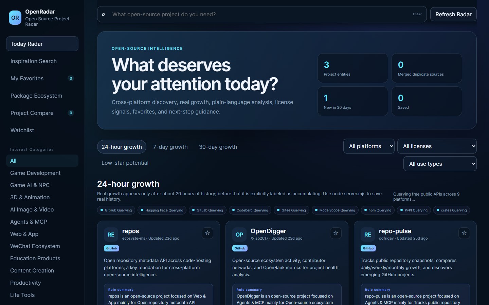
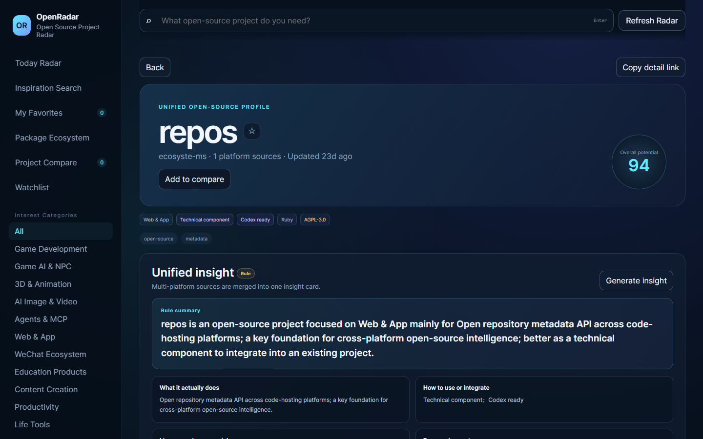
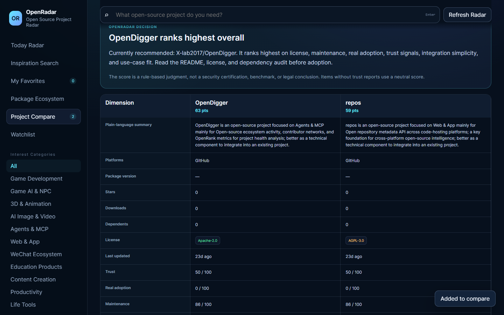
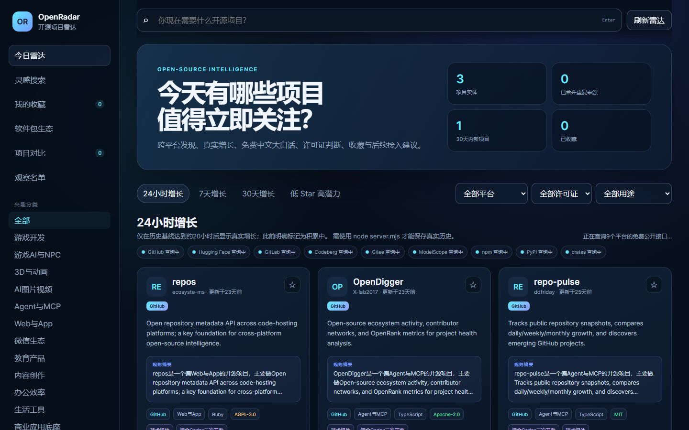

# Open Source Radar

> Discover, evaluate, and reuse open-source projects instead of rebuilding from scratch.

**English** · [简体中文说明](README.md)

Open Source Radar is a local-first discovery and evaluation tool for open-source projects, models, and software packages. It combines goal-oriented search, local history, conservative cross-platform identity matching, trust signals, project comparison, and Codex research-packet export in one runnable workspace.

It is not another GitHub Trending clone. A ranking is only one input. The product keeps source records separate, shows when growth is backed by local history, distinguishes facts from rules and AI explanations, and helps a person decide whether a project is worth reusing.

## Screenshots

The interface is available in English and Simplified Chinese. The screenshots
below are real captures from a local run of the app (deterministic demo data
only; live upstream results depend on your network and the providers).

| Main radar | Project detail + insight |
| --- | --- |
|  |  |

| Project compare | Simplified Chinese main radar |
| --- | --- |
|  |  |

The Chinese UI mirrors the same views and features.

## Current capabilities

- Sources: GitHub, Hugging Face, GitLab, Codeberg, ModelScope, npm, PyPI, and crates.io.
- Gitee remains a degraded external-search path and is not counted as a real-time source when its official path is unavailable.
- Local history for real 24-hour, 7-day, and 30-day changes after enough time has elapsed. A missing baseline is shown as accumulating rather than invented.
- Conservative identity merging, manual merge/split/primary-source corrections, and preservation of original source IDs and metrics.
- On-demand OpenSSF Scorecard, deps.dev, and OSV signals. These are public risk signals, not security certification or a guarantee of no vulnerabilities.
- Two-to-five project comparison using local rule-based dimensions, not a performance benchmark or legal conclusion.
- Optional local Ollama explanations using `qwen3:4b`; rule summaries remain available when Ollama is unavailable.
- Complete local backup/restore, including favorites, comparison state, history, insights, trust reports, identity corrections, and Codex research packets.
- Server-side upstream gateway for normal platform/package calls, with bounded cache, ETag revalidation, in-flight dedupe, timeout, retry, provider isolation, and visible degraded/stale states.

## Local-first and cost model

The first version is designed around zero paid API cost. Run `node server.mjs` so local persistence, the upstream gateway, package adapters, Gitee fallback behavior, trust checks, and Ollama integration are available. The app does not ship a GitHub token or any other service secret. An optional `GITHUB_TOKEN` may be supplied to the server process through an untracked `.env`/environment configuration; it is never sent to browser code or returned by `/api/health`.

Runtime data stays local and is ignored by Git: `data/*.json` and generated files under `exports/codex/`. The favorites compatibility key is `openradar:favorites:v1`; comparison state uses `openradar:compare:v1`.

## Quick start on Windows

1. Install Node.js and Python.
2. Double-click `START-OPENRADAR.bat` or `start-openradar.cmd`.
3. Keep the terminal open and visit `http://localhost:8080`.

The launcher deliberately keeps an error window visible if startup fails. For a terminal launch, run:

```bash
node server.mjs
```

## Requirements

- Node.js 20 or newer is the baseline; the release acceptance was run on
  Node 24 on Windows.
- Python is optional: it is only used for the mocked browser test, not for
  running the product.
- No paid API, account, or token is required for the base experience. An
  optional `GITHUB_TOKEN` may be supplied to the server process only.
- Optional local Ollama (`qwen3:4b`) for Chinese explanations; rule summaries
  work without it.

## Windows and proxy note

The project does not hardcode a proxy address. If your network requires one,
configure it through environment variables before starting the server:

```text
NODE_USE_ENV_PROXY=1
HTTP_PROXY=<your proxy>
HTTPS_PROXY=<your proxy>
NO_PROXY=localhost,127.0.0.1,::1
```

## Tests

```bash
node --test tests/*.mjs
python tests/browser_mock_test.py
```

CI runs these tests plus JavaScript syntax checks, Python compilation, and JSON parsing. CI does not call live third-party APIs.

## Upstream and data caveats

Public endpoints can be rate-limited, unavailable, changed, or subject to terms that differ from the repository license. npm monthly downloads, PyPI auxiliary download signals, and crates.io cumulative/recent downloads are not directly comparable. The source and license review is recorded in `docs/UPSTREAM_AUDIT.md` and `docs/SOURCE_LEDGER.json`.

The current artifact still needs user-facing live acceptance for all upstream sources, public maintenance/adoption evidence, and natural-time history. The gateway's memory cache is cleared on server restart. See `docs/UPSTREAM_GATEWAY_DECISION.md`, `docs/PUBLIC_RUNTIME_RISK_REGISTER.md`, and `ROADMAP.md`.

## Current beta limitations

- Gitee is fallback-only external search and is not counted as live or growth data.
- Real growth requires natural time; missing baselines show as "accumulating".
- npm monthly, PyPI auxiliary, and crates cumulative/recent download signals
  are not directly comparable.
- The upstream gateway cache is memory-only and clears on restart; cached or
  degraded results are explicitly not live data.
- Authenticated GitHub is optional and not required; anonymous mode is the
  verified base experience.
- Trust signals are risk signals, not security certification, and a missing
  result is not proof of safety.
- Upstream availability varies by network and may require a proxy.
- The screenshots in this README were captured from the real local interface
  using built-in demo data; they do not imply live provider availability.

## Contributing and license

Please read `CONTRIBUTING.md`, `SECURITY.md`, and `CODE_OF_CONDUCT.md` before opening an issue or pull request. The repository code is MIT-licensed as documented in `LICENSE`, subject to the source/data caveats in the ledger. That ledger is engineering documentation, not legal advice.

The project is in public beta (`v0.1.0`). It has no verified external adoption
or maintenance history yet; do not interpret the local OSS readiness score as
an OpenAI score or as an application endorsement. The release-gate audit is
recorded in `docs/PUBLIC_RELEASE_GATE.md`.

For the existing Chinese product notes and API details, see `README.md`.
